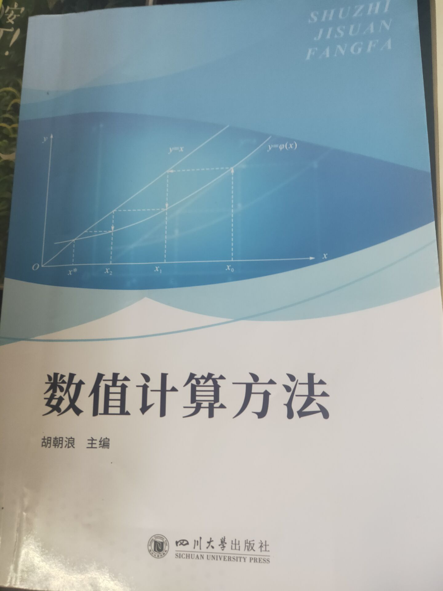

# 课程信息

工程数学数值计算方法

课程开设时间 ：学年下学期

推荐选课年级 ：大一/二

课程号 201023020

## 课程内容

计算机解决数学问题

几个等价名称
- 数值计算方法
- 计算数学
- 数值分析
- 数值方法

实际问题 -> 数学模型 -> 构建数值计算方法 -> 分析数值计算方法 -> 程序设计与编写 -> 计算机（近似）解

## 前置课程

- 微积分(学了第一学期就够用了，主要是求导和泰勒展开)
- 线代(了解就行)
- matlab(边学边用 会教)

## 分数构成

## 课程要求

刘长丽：上课不许玩手机

## 课本信息

其他课本信息：
- 978-7-5690-4811-7
- 数值计算方法 胡朝浪 四川大学出版社
- 2021.9

## 参考资料

